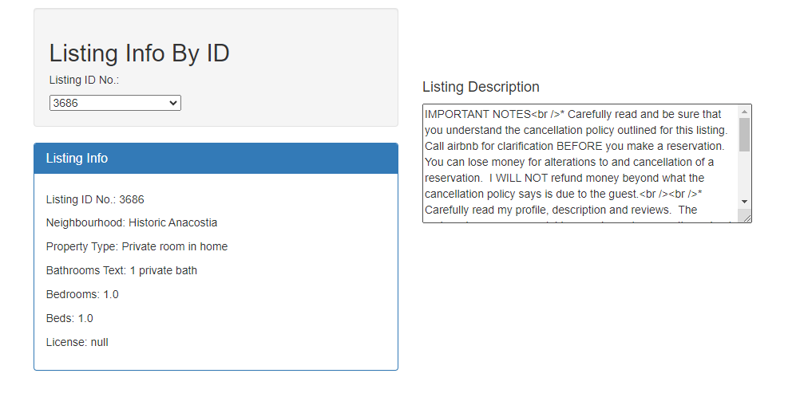
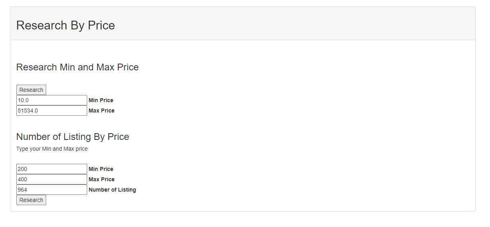
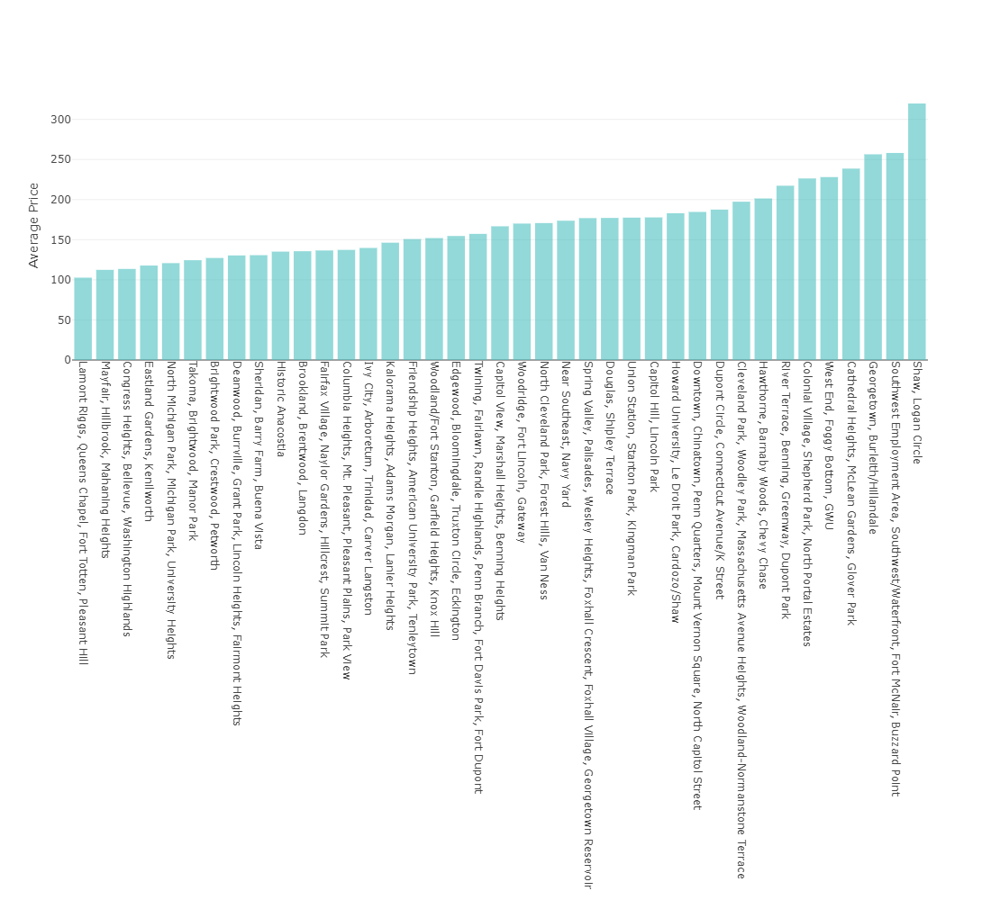
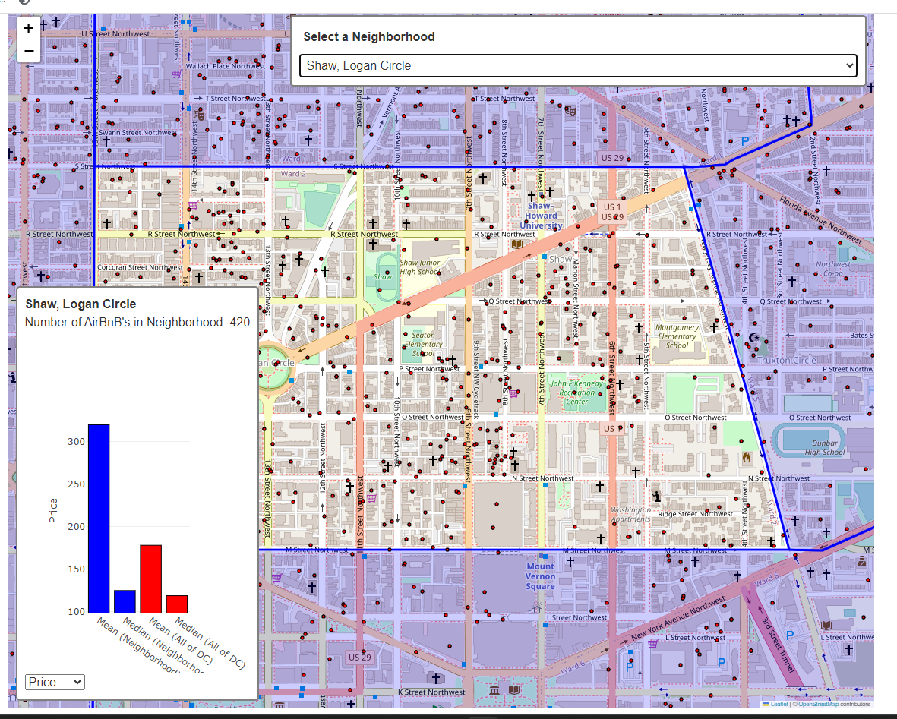
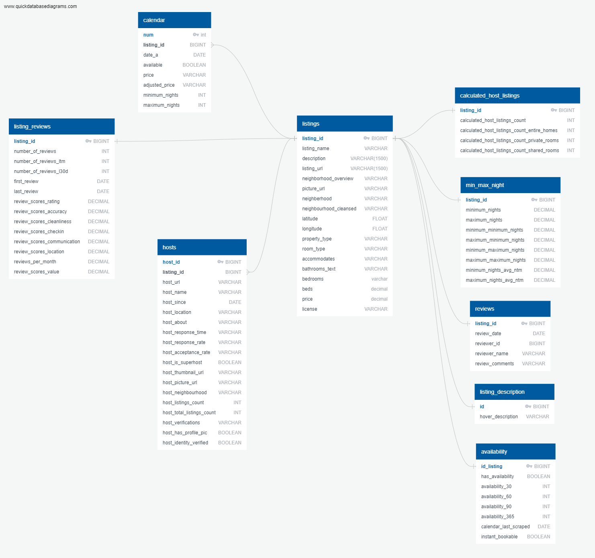

# DC AirBnB

## Ideas

Chloropleth map of price (ratings, number of listings, etc)?

Color code map markers by property type (entire home, room...)

Sorted list of Max/Median price per neighbourhood, highlight chosen neighbourhood

Plot host license percentages (licensed or not)

Plot property type distribution (% entire house, private room...)

List top 10 hosts with most listings

Development on this project has restarted.

## Table of Contents

- [Description](#description)
- [Usage](#usage)
- [Gallery](#gallery)
- [References](#references)
- [Licenses](#licenses)
- [Acknowledgements](#acknowledgements)
- [Author](#author)

## Description

A detialed analysis of Washington D.C.'s AirBnB's, offering a wide variety of metrics for evaluating AirBnB's in Washington, DC, designed to help a consumer choose their personal perfect AirBnB. We generate a variety of charts, tables, and an interactive map and make them avialable to the user.

## Usage

`app.py` will launch a Flask development server that you can use to host the website. Click on the website and navigate around it. Interact with the charts and tables and map to gather information and evaluate AirBnB's in DC.

`airbnb` is a backup of the database, that a user can load into a postgres database.

The `/database` folder contains the csv's and SQL code used to create the database. `cleaning data.ipynb` shows the ETL process.

`/exploratory_data_analysis` contains `eda.ipynb`, showing our exploratory data analysis.

## Gallery

Listing Info:

Research by Price:

Price By Neighborhood:

Map:

ERD:

## References

Dataset provided by [Inside AirBnB](http://insideairbnb.com/about/). We used the quarterly data summary from 18 June, 2023 - 13 September, 2023.

## Licenses

[Creative Commons Attribution 4.0 International License](http://creativecommons.org/licenses/by/4.0/)

## Acknowledgements

Thanks to Geronimo Perez for feedback and assistance

## Author
Amber Amparo, Moussa Diop, Bryan Johns, Imen Najar, October, 2023
