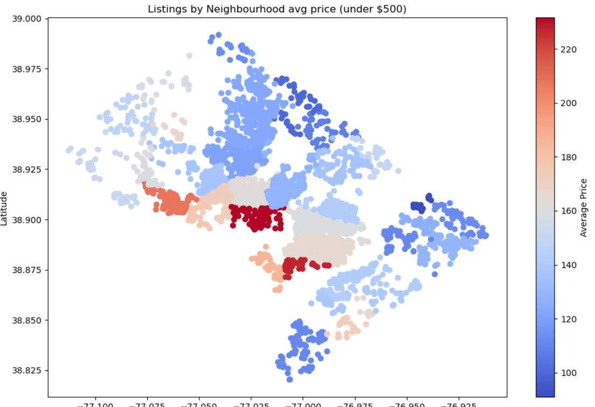

# DC AirBnB

## Table of Contents

- [Description](#description)
- [Usage](#usage)
- [Gallery](#gallery)
- [Certificate](#certificate)
- [References](#references)
- [Licenses](#licenses)
- [Acknowledgements](#acknowledgements)
- [Author](#author)

## Description

A detialed analysis of Washington D.C.'s AirBnB's, offering a wide variety of metrics for evaluating the vacation rental market in Washington, DC., utilizing a PostgreSQL database to conduct an exploratory data analysis and present interactive visualiztions to communicate the findings via a live website and a Tableau explanatory data analysis.

The website is configured to run from the client-side only on GitHub Pages. A Flask app and Django version are also developed to create server-side versions, pulling from the PostgreSQL database.

Further analysis will continue after using an API to extract data from the federal census bureau and local DC city government, to compare the impact of the rental market on housing availability and affordability.

## Usage

The `/docs/` folder contains a GitHub Pages version of the interactive website, hosted live at [johbry17.github.io/DC-AirBnB-Data/](https://johbry17.github.io/DC-AirBnB-Data/). Click on the website and navigate around it. Interact with the charts and map to gather information and evaluate AirBnB's in DC.

A Tableau explanatory data analysis is embedded within the website, and can also be found online at [public.tableau.com/app/profile/bryan.johns6699/viz/DC-Airbnb/DCAirbnbMobile](https://public.tableau.com/app/profile/bryan.johns6699/viz/DC-Airbnb/DCAirbnbMobile). A copy is stored in the root repo as `DC-Airbnb.twbx`.

It all began with an exploratory data analysis, located at `/exploratory_data_analysis/eda.ipynb`.

`/django/django_airbnb_dc/python manage.py runserver` deploys a Django version of the website. `/flask/app.py` activates a Flask server that launches a full stack version of the website.

`airbnb.backup` is a backup of the database, that a user can load into a PostgreSQL database. Command line restore syntax: `pg_restore -U username -d dbname -1 /path/to/backup/file`.

### Note to self: If updating data...

Run `data_processing.ipynb` to update the data source for both the Flask and GitHub Pages versions of this project. Make any alterations necessary to `schema.sql` and `data_processing.ipynb` (the `paths` or `neighbourhoods_dict` at the top), both located in `/resources/data/cleaned_data/`. Pay particular attention to the `map_listings` and `price_availability` views, as they are exported to csv's for GitHub Pages and Tableau.

Don't forget to .gitignore any files over 100MB.

The ETL process depicted in `data_processing.ipynb` served as the final project for [cs50's Introduction to Databases with SQL](https://cs50.harvard.edu/sql/2024/), which can be found in my [DC-AirBnB-SQL-Database](https://github.com/johbry17/DC-AirBnB-SQL-Database) repo. The Jupyter Notebook not only cleans the data, it automatically loads a PostgreSQL database and extracts relevant data into csv's for the GitHub Pages version of the site, neatly preparing the data for the full-stack Flask version and the static, front-end-only version. The Tableau exploratory data analysis uses the same csv's.

### Errata

The price-availability plot in the Flask app has formatting issues, and the annotations are off. Remember to toggle between data filters for allDCData in plotPriceAvailability() for Flask and GitHub Pages.

## Gallery

Tableau:

Web Plot:

Web Map Images:

Exploratory Data Analysis:

Entity Relationship Diagram:

## Certificate

## References

Dataset provided by [Inside AirBnB](http://insideairbnb.com/about/).

## Licenses

[Creative Commons Attribution 4.0 International License](http://creativecommons.org/licenses/by/4.0/)

## Acknowledgements

Sincerest thanks to Imen Najar for assistance on an early version of this project.

Thanks to Geronimo Perez for feedback and assistance.

## Author

Bryan Johns, October, 2024
