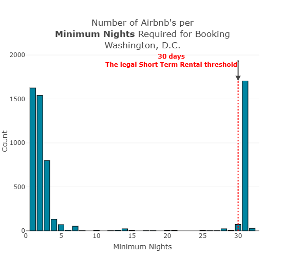
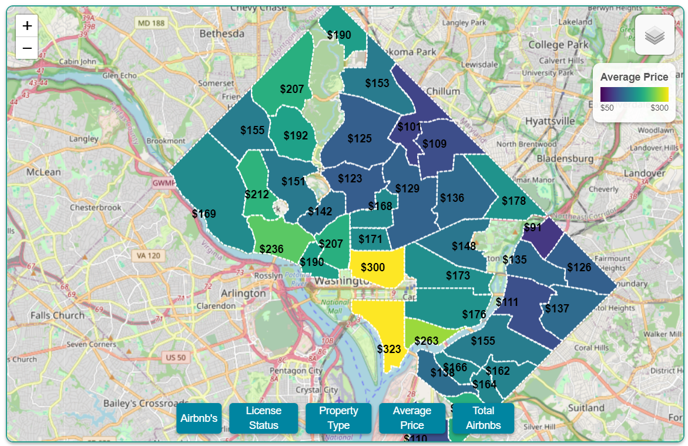

# Capital CrashPad: DC Short-Term Rental Explorer

*Explore, visualize, and understand DC’s Airbnb landscape—interactive dashboards and maps powered by open data and modern web tech.*

🔗 [Live Website](https://johbry17.github.io/DC-AirBnB-Data/)  
🔗 [Tableau Dashboard](https://public.tableau.com/app/profile/bryan.johns6699/viz/DC-Airbnb/DCAirbnbMobile)  
🔗 [Exploratory Data Analysis (EDA)](/exploratory_data_analysis/eda.ipynb)

> ℹ️ Status: This project is maintained as a portfolio example. While not under active development, data and dashboards are refreshed quarterly as new information becomes available.

## Table of Contents

- [Project Overview](#project-overview)
- [Features](#features)
- [Tools & Technologies](#tools--technologies)
- [Usage](#usage)
- [Gallery](#gallery)
- [References](#references)
- [License](#license)
- [Acknowledgements](#acknowledgements)
- [Author](#author)

## Project Overview

This full-stack project explores the landscape of short-term rentals in Washington, DC. Using data from Inside AirBnB, it combines:

- A **live, interactive web dashboard** hosted on GitHub Pages
- A **Tableau story-style EDA** for strategic analysis
- A **PostgreSQL backend** with Flask and Django implementations
- A **Jupyter-based ETL pipeline** that transforms and loads data for multiple outputs

The goal is to visualize the availability, pricing, and neighborhood distribution of short-term rentals and highlight interesting patterns in the DC vacation rental market.

## Features

- Dynamic map with multiple layers and neighborhood overlays
- Interactive plots aggregating neighborhood trends
- Tableau dashboard for filtering and exploring rental trends
- Clean ETL pipeline to prep and load data across platforms
- Choropleth and bubble maps to compare neighborhoods
- Flask and Django versions for backend experimentation
- Mobile-friendly static version with JavaScript interactivity

## Tools & Technologies

- **Data**: Inside AirBnB, CSV, PostgreSQL, SQLite
- **Backend**: Flask, Django, SQL, Jupyter, Pandas
- **Frontend**: JavaScript, Plotly, Leaflet, Bootstrap, HTML/CSS
- **Visualization**: Tableau, Choropleths, Bubble Maps, Plotly
- **Deployment**: GitHub Pages, Tableau Public


## Usage

### Website
- [Visit GitHub Pages version](https://johbry17.github.io/DC-AirBnB-Data/) 
- Explore listings, prices, and availability
- Navigate through the embedded Tableau dashboard

### ETL Pipeline
- Edit and run `data_processing.ipynb` to clean and update source data
- Automatically loads PostgreSQL tables and exports data for Flask and GitHub Pages

### Full-Stack Versions
- Flask app: `flask/app.py` (pulls from PostgreSQL)
- Django app: `django/django_airbnb_dc` (uses SQLite)

### Data Backup
Restore the included PostgreSQL backup:
```bash
pg_restore -U <username> -d <dbname> -1 airbnb.backup
```


### Note to Self
- Run all cells in `data_processing.ipynb` to update the source data
- Recheck plotPriceAvailability annotations in `plots.js` after updates
- Review `schema.sql` and `neighbourhoods_dict` in `data_processing.ipynb`
- Export updated `map_listings` and `price_availability` views to CSV for GitHub Pages
- Leave Tableau as-is (June 2024)

### Errata
The Flask / Django version of the price-availability chart has formatting issues. Be sure to toggle the allDCData filter correctly in `plotPriceAvailability()`.

## Gallery

Tableau Dashboard:


Web Dashboards Plots:




Interactive Map:





Exploratory Data Analysis:


Entity Relationship Diagram:


## Course Certificates

Parts of this project served as capstones for two of HarvardX’s free online computer science courses:  
- [CS50's Web Programming with Python and JavaScript](https://cs50.harvard.edu/web/2020/)
- [CS50's Introduction to Databases with SQL](https://cs50.harvard.edu/sql/2024/)


## References

Dataset provided by [Inside AirBnB](http://insideairbnb.com/about/).

## License

[Creative Commons Attribution 4.0 International License](http://creativecommons.org/licenses/by/4.0/)

## Acknowledgements

- Thanks to Imen Najar for early insights and support.
- Thanks to Geronimo Perez for feedback and assistance during development.

## Author

Bryan Johns, October 2024  
[bryan.johns.official@gmail.com](mailto:bryan.johns.official@gmail.com) | [LinkedIn](https://www.linkedin.com/in/b-johns/) | [GitHub](https://github.com/johbry17) | [Portfolio](https://johbry17.github.io/portfolio/index.html)

