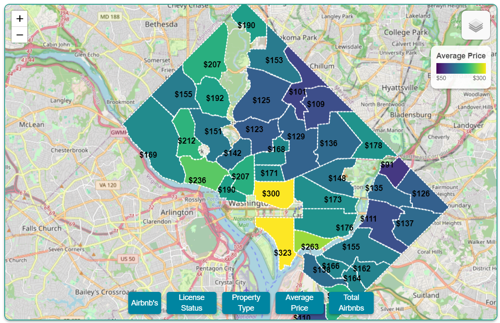
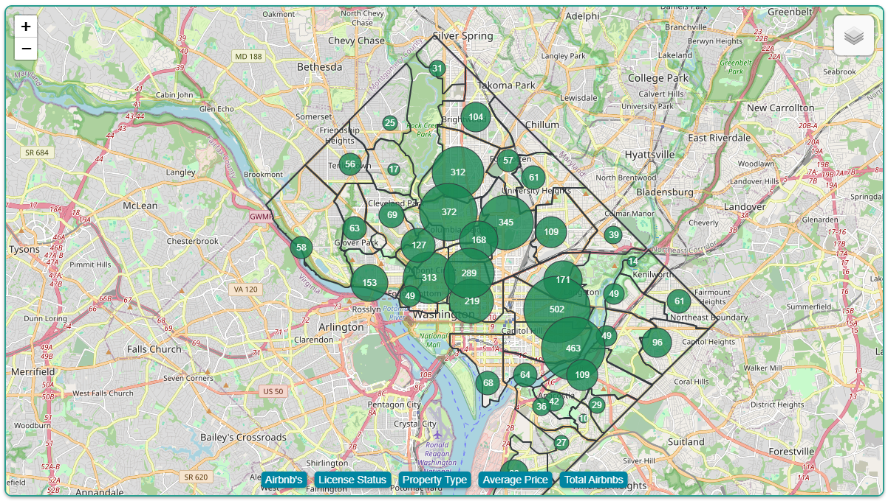

# DC AirBnB

YouTube video link: https://youtu.be/6-_0o7J-3Ek

## Table of Contents

- [Description](#description)
- [Distinctiveness and Complexity](#distinctiveness-and-complexity)
- [Usage](#usage)
- [File Overview](#file-overview)
- [Gallery](#gallery)
- [Errata](#errata)
- [References](#references)
- [Licenses](#licenses)
- [Acknowledgements](#acknowledgements)
- [Author](#author)

## Description

A web dashboard displaying data visualizations related to Washington D.C.'s AirBnB scene.

It's part of a data analysis of Washington D.C.'s AirBnB's, offering a wide variety of metrics for evaluating the vacation rental market, utilizing a PostgreSQL database to conduct an exploratory data analysis and present interactive visualizations to communicate the findings via a live website and a Tableau explanatory data analysis.

The project includes multiple versions, found in the original repo [here](https://github.com/johbry17/DC-AirBnB-Data):

- **GitHub Pages**: A client-side static [website](https://johbry17.github.io/DC-AirBnB-Data/) hosted on GitHub Pages.

- **Flask App**: A server-side version of the app using Flask and PostgreSQL.

- **Django App**: A Django version utilizing a SQLite database.

Additionally, future iterations will expand with external data from the U.S. Census Bureau and D.C. government to examine the broader housing market's relationship with short-term rentals. (Translation: I want to do an exploratory data analysis in R using an API, and I bet it turns up something interesting)

## Distinctiveness and Complexity

Note: My background is in data analysis and visualization, so my coding projects are geared towards furthering that skill set. Also, I live in DC, so these are my old stomping grounds, and I choose projects than are relevant to me. As noted above and below, this Django website is part of a larger data analysis project.

**Distinctiveness**: This is a data visualization dashboard. The other projects for this course were a mock reproduction of Google's search pages, a wiki, an auction / eBay site, an email server, and a social network site akin to Twitter. A dashboard is nothing like those prior projects.

**Complexity**:

- **Multi-Version Implementation**: The project is developed in multiple frameworks: a client-side version utilizing a csv for the data source, and two server-side versions: a Flask app and a Django app. Only the Django version is included here, see [this](https://github.com/johbry17/DC-AirBnB-Data) repo for the rest. This demonstrates proficiency in different web development paradigms.

- **Data-Driven Visualizations**: This project integrates complex data visualizations with Plotly and Tableau, allowing for user interaction. Integrating Tableau shows proficiency in connecting web development with external platforms for storytelling and visualization. The amount of JavaScript written, modularized into multiple files, to create the various map layers and plots, is vastly more complex than anything done for prior coursework, and demonstrates an understanding of scalable code organization.

- **Advanced Data Modeling**: The project includes detailed database models, creating relationships between hosts, listings, reviews, and availability data. This data is normalized across multiple tables and includes complex metrics like availability windows and review scores. The amount of data displayed far exceeds any of the Django models that were created in prior coursework.

- **SQLite Integration**: The Django version interacts with a SQLite database for data storage. Note how it contains far more data than is used in the actual web dashboard, allowing for future use as needed. The database was designed with an eye towards flexibility and scalability and in anticipation of future integration of U.S. Census or local DC government data.

- **Mobile-Responsive**: This project was primarily designed to be mobile responsive, even if some Plotly features (mostly the line chart) render better on desktop.

- **Exploratory Data Analysis**: This project required an in-depth [exploratory data analysis](https://github.com/johbry17/DC-AirBnB-Data/blob/main/exploratory_data_analysis/eda.ipynb) before even beginning the website.

This project stands out due to its use of real-world data, complex relationships in the database schema, and integration of server-side data handling with data visualizations.

## Usage

Installation:

- To install dependencies, run `pip install -r requirements.txt` in the project directory.

- To create the SQLite database, open `./resources/data/data_processing.ipynb` and click "Run All" at the top to populate the SQLite database.

To run the Django version, navigate to the `django_airbnb_dc` directory and use the following command:

    `python manage.py runserver`

Use the buttons on the map and dropdown menu at the top of the screen to explore the data on a city- or neighborhood-level. Hover or tap on the plots and map to see further information. Individual AirBnB's are displayed, and can be toggled based upon license status and property type. City-level layers include a choropleth map of average price per neighborhood and a bubble map of the total number of AirBnB's per neighborhood. Charts below the map display data based upon the neighborhood selection from the dropdown menu.

---

A GitHub Pages version of the interactive website is hosted live at [johbry17.github.io/DC-AirBnB-Data/](https://johbry17.github.io/DC-AirBnB-Data/). Users can interact with charts and maps to gather insights into AirBnB listings in D.C.

A Tableau explanatory data analysis is embedded within the website, and can also be viewed directly online at [public.tableau.com/app/profile/bryan.johns6699/viz/DC-Airbnb/DCAirbnbMobile](https://public.tableau.com/app/profile/bryan.johns6699/viz/DC-Airbnb/DCAirbnbMobile).

The original exploratory data analysis can be found online [here](https://github.com/johbry17/DC-AirBnB-Data/blob/main/exploratory_data_analysis/eda.ipynb). Note that the interactive Plotly charts do not appear. I really need to upload it to Google Colab. A display-only copy is located in `/resources/exploratory_data_analysis/eda.ipynb`.

## File Overview

This is a breakdown of key files and their contents, contained within `django_airbnb_dc/airbnb_data_hub_dc/`.

On the client-side:

- `templates/index.html` - The HTML for the project.

- `static/css/styles.scss` and `static/css/styles.css` - The Sass and CSS for the DC AirBnB Data Analysis project.

- `static/js/app.js` - Main JavaScript file that initializes the DC AirBnB Data Analysis project.

- `static/js/colors.js` - Sets the color palette for data visualizations. A convenient location to toggle colors for the map and plots.

- `static/js/map.js` - This file contains the functions to create the map, overlays, and controls, and to handle user interactions.

- `static/js/mapLayers.js` - Utility functions to create and initialize the map layers - the neighborhoods, choropleth map, bubble map, and markers. It controls the data displayed on top of the map.

- `static/js/plots.js` - JavaScript file for creating all plots using Plotly.js. The data visualization parameters for the bar, pie, and line charts.

- `static/js/dataUtils.js` - Utility functions for data processing and analysis. Basically, the mathematics. Any necessary calculations are found here.

- `static/resources/neighbourhoods_cleaned.geojson` contains the GeoJSON features outlining the neighbourhood boundaries.

The server-side of the Django application consists of the following files:

- `models.py`: Contains the Django models used to recreate the PostgreSQL schema (located in the root repo `/resources/data/schema.sql`). There are far more models than actually used in this web page, in case of future usefulness.

- `urls.py`: Defines the URL paths and maps them to views.

- `views.py`: Handles the logic for rendering pages and processing data requests.

Additionally, `django_airbnb_dc/django_airbnb_dc/settings.py` configures the project.

The root directory contains files used in installation, and helpful resources, like the exploratory data analysis:

- The `resources/data` folder contains `data_processing.ipynb`, used to create the SQLite database.

- The `resources/data` folder contains csv backups of each table within the database, and the `schema.sql` used to create the original PostgreSQL database that inspired `views.py` and `models.py` in creating the SQLite database used for the django app.

- A copy of the exploratory data analysis is located in `resources/exploratory_data_analysis/eda.ipynb`.

## Gallery

Tableau:

Web Plot:

Web Map Images:

Exploratory Data Analysis:

Entity Relationship Diagram:

## Errata

N.B. - Both of these errors are corrected in the published GitHub Pages version, as well as the Flask version. They only exist in the Django version.

In the Price and Availability line plot, the average price per day is off slightly, ONLY for all of DC. It works fine for each individual neighborhood.

The Ratings plot is off, especially the Mean. In the process of switching from Flask-PostgreSQL to Django-SQLite, it must somehow be including nulls or zeros to pull down the average, despite no changes to the relevant JavaScript in `dataUtils.js`.

## References

Dataset provided by [Inside AirBnB](http://insideairbnb.com/about/).

## Licenses

[Creative Commons Attribution 4.0 International License](http://creativecommons.org/licenses/by/4.0/)

## Acknowledgements

Thanks to the entire cs50 team for the opportunity to learn and for creating a high quality educational experience.

Sincerest thanks to Imen Najar for assistance on an early version of this project.

Thanks to Geronimo Perez for feedback and assistance.

## Author

Bryan Johns, February, 2025
