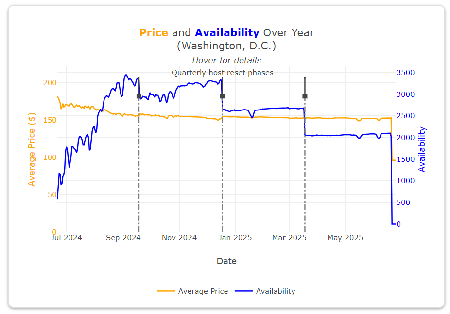
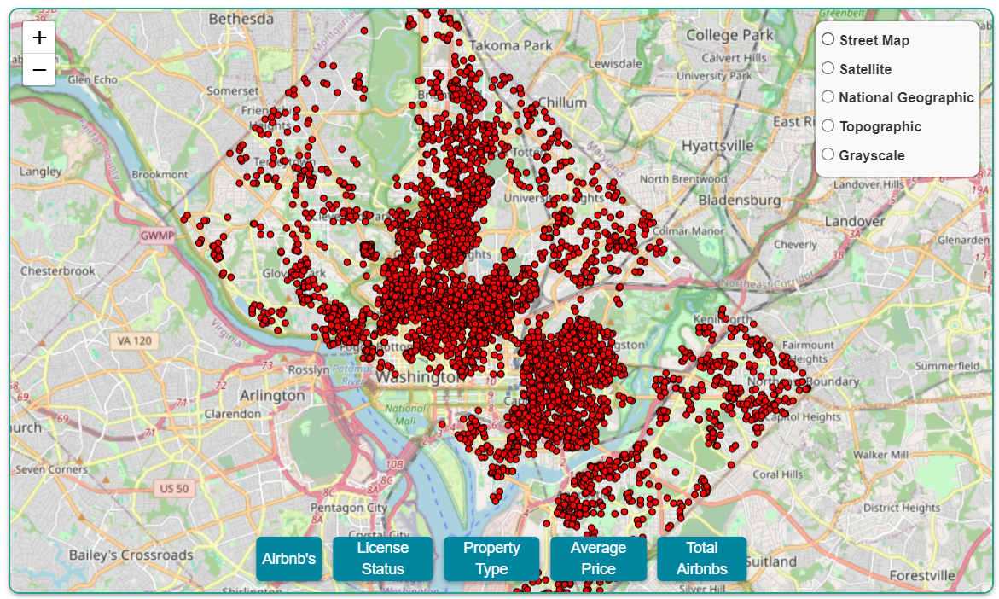
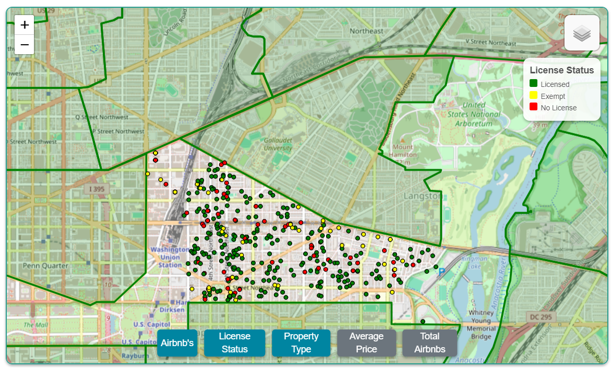
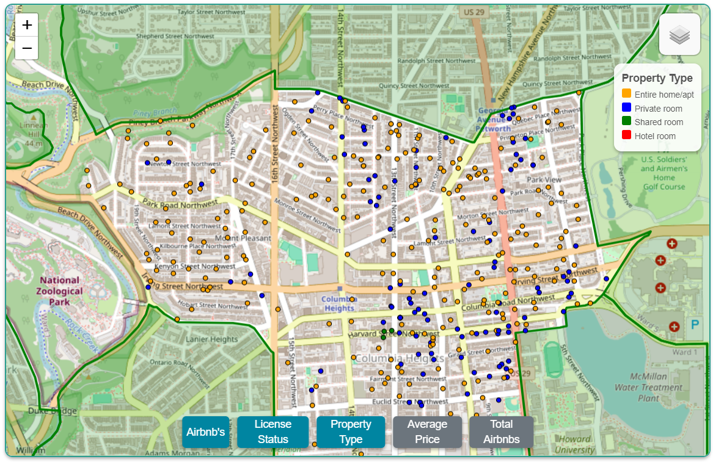

# DC AirBnB

!!!!!!!!!!DJANGO VERSION!! FOR CS50!!!!!!!!

## Table of Contents

- [Description](#description)
- [Usage](#usage)
- [Gallery](#gallery)
- [References](#references)
- [Licenses](#licenses)
- [Acknowledgements](#acknowledgements)
- [Author](#author)

## Description

A detialed analysis of Washington D.C.'s AirBnB's, offering a wide variety of metrics for evaluating the vacation rental market in Washington, DC., utilizing a PostgreSQL database to conduct an exploratory data analysis and present interactive visualiztions to communicate the findings via a live website and a Tableau explanatory data analysis.

The project includes multiple versions:

* **GitHub Pages**: A client-side static website hosted on GitHub Pages.

* **Flask App**: A server-side version of the app using Flask.

* **Django App**: A more robust Django version, which integrates PostgreSQL for data persistence and server-side rendering.

Additionally, future iterations will expand with external data from the U.S. Census Bureau and D.C. government to examine the broader housing market's relationship with short-term rentals.

## Usage

The `/docs/` folder contains a GitHub Pages version of the interactive website, hosted live at [johbry17.github.io/DC-AirBnB-Data/](https://johbry17.github.io/DC-AirBnB-Data/). Click on the website and navigate around it. Interact with the charts and map to gather information and evaluate AirBnB's in DC.

A Tableau explanatory data analysis is embedded within the website, and can also be found online at [public.tableau.com/app/profile/bryan.johns6699/viz/DC-Airbnb/DCAirbnbMobile](https://public.tableau.com/app/profile/bryan.johns6699/viz/DC-Airbnb/DCAirbnbMobile).

`/django/django_airbnb_dc/python manage.py runserver` deploys a Django version of the website.

`airbnb.backup` is a backup of the database, that a user can load into a PostgreSQL database. Command line restore syntax: `pg_restore -U username -d dbname -1 /path/to/backup/file`.

## Gallery

Tableau:

Web Plot:

Web Map Images:

Exploratory Data Analysis:

Entity Relationship Diagram:

## References

Dataset provided by [Inside AirBnB](http://insideairbnb.com/about/).

## Licenses

[Creative Commons Attribution 4.0 International License](http://creativecommons.org/licenses/by/4.0/)

## Acknowledgements

Thanks to the entire cs50 team for the opportunity to learn and creating a high quality educational experience.

Sincerest thanks to Imen Najar for assistance on an early version of this project.

Thanks to Geronimo Perez for feedback and assistance.

## Author

Bryan Johns, October, 2024
